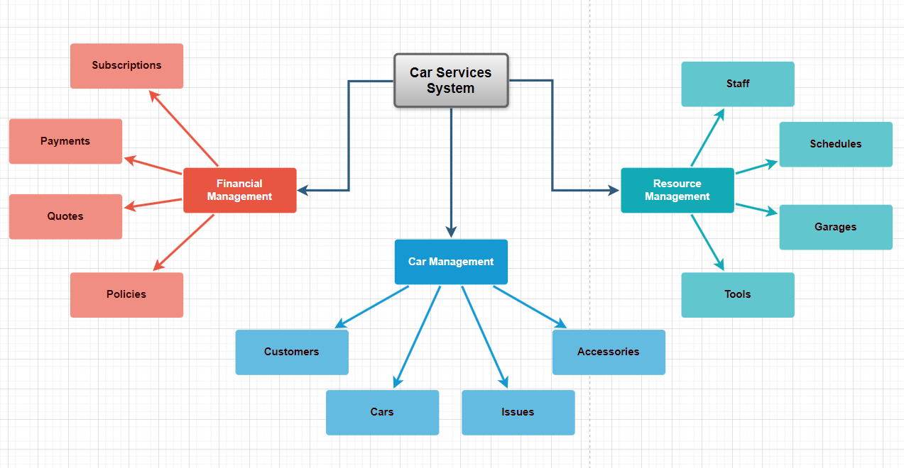

# Car Services System - Architectural Overview

NOTE⚠️: _Reading this document may lead to a different perception of the project compared to what is written in the [README](../../README.md) file, so that it will appear to readers as a real software product of high quality, directed to real customers and available for sale/purchase. From this point, the developers and testers are expected to interact with the system as real users (non developers). We would like this to be the goal_ 😁 _, because technologies employed in this project, are mostly used for **enterprise** purpose, and we want to help developers to learn how to deal with such projects in an entertaining manner. It's worth noting that this project remains dedicated for learning objectives. In case you think about using this project for commercial uses, we remind you to read its [licence](../../LICENSE) carefully before you start._

NOTE⚠️: _The current code-base of the project was made quickly without thinking too much about long term objectives. With this document, it would be obvious to review the code-base and refactor it based on the information provided here. Thus, a new issue should be created for this [heavy] work._

## Motivation
In software development, understanding the problem before diving into code is crucial. Jumping straight into coding without proper analysis often leads to what architects call a ["big ball of mud"](https://en.wikipedia.org/wiki/Anti-pattern#Software_engineering_anti-patterns)—a disorganized, unsustainable codebase that can cause projects to fail. 

Successful developers prioritize modeling and planning to create a clear overview of the problem, which helps in crafting a well-structured and maintainable solution. Striving for perfection in this stage, even if it’s never fully achieved, ensures a robust and scalable system that can evolve over time.

👉 This project, is a deliberate effort to apply these principles, aiming to build a well-organized and efficient solution from the ground up.

## Primary Business-Objective (BO)

This section is about setting the _Primary Business Objective (BO)_ of the **Car Service** system, once it's ascertained, in terms of the “what, why, and how” of it, that objective is systematically broken down into small pieces based on prioritization.

### What is it (What?)

Comprehensive [Web application](https://en.wikipedia.org/wiki/Web_application) designed to streamline and manage car services efficiently. It provides an organized and client-friendly interface for managing car-related services, including repairs, maintenance, customer requests and more.

### Reason (Why?)

To enhance customer satisfaction and operational efficiency, by providing a centralized system that automates and simplifies the management of car services. This leads to improved service delivery, reduced errors, and optimized resource utilization.

### Implementation (How?)

By using [Spring Boot](https://spring.io/projects/spring-boot), a robust [Java](https://www.java.com/en/download/help/whatis_java.html)-based framework, designed with scalability, flexibility, security, persistence and more. The development process is based on the [12-factor](https://12factor.net/) methodology, ensuring it as a modern cloud-native application.

The system is a [REST](https://restfulapi.net/) API, following the [**MVC pattern**](https://en.wikipedia.org/wiki/Model%E2%80%93view%E2%80%93controller), to maintain clear separation between the model, view, and controller layers. [**Domain-Driven Design (DDD)**](https://en.wikipedia.org/wiki/Domain-driven_design) will be used to distinguish competitive features from normal ones, ensuring the system focuses on delivering value where it matters most.

To further clarify the system’s design, **[UML](https://en.wikipedia.org/wiki/Unified_Modeling_Language) diagrams** illustrate:
- Actors, scenarios, and relationships;
- Preconditions, post-conditions and error cases;
- Abstractions and enums;
- Database tables and their relationships;

## System Business Components

NOTE⚠️: _The following information are preliminary details concluded from a renewable review on the project at its current state. It's highly recommended to do refinements on these information along with the development process, as new concerns or challenges may appear on the road._

This section is about splitting the project's _Primary Business Objective_ into main pieces, also known as business components:

1. Cars Management
2. Resource Management
3. Financial Management

NOTE⚠️:_The diagrams [source file](./diagrams.drawio) is available for reuses. You can download from GitHub and open it on [draw.io](https://app.diagrams.net/) for free._ 

### Cars Management

This component is focused on both car-related entities and customer interactions. It's considered a core component.

It's composed of the following subcomponents.

1. **Customers**: Manages customer information, whether they are individuals or companies. This subcomponent is essential for personalizing services and maintaining customer relationships.

2. **Cars**: Manages cars based on some characteristics like size, brand, type, etc...

3. **Issues**: Handles cars issues like fixes, upgrades, washes, parts replacement, painting, etc...

4. **Accessories**: Tracks and manage accessories available for cars.

### Resource Management

This component focuses on managing both human and physical resources required for car services. It includes the following subcomponents:

1. **Staff**: Handles information about staff members, including managers, commercial agents, maintainers, and workers. This subcomponent ensures that the right personnel are assigned to the appropriate tasks.

2. **Schedules**: Manages staff schedules, ensuring efficient allocation of resources and timely delivery of services.

3. **Garages**: Manages information about garages, including their location, equipment, capacity, and availability.

4. **Tools**: Tracks and manages the tools available in the garages, ensuring that necessary equipment is available for performing car services efficiently.

### Financial Management

This component handles the financial aspects of the system. It includes the following subcomponents:

1. **Subscriptions**: Manages subscription-based offers and service packages available to customers. This subcomponent allows customers to subscribe to various service plans, track subscription details, handle renewals, and manage associated benefits.

2. **Payments**: Manages payment processing for services provided. This subcomponent ensures that transactions are handled securely and efficiently.

3. **Quotes**: Generates and manages quotes for car services. This subcomponent supports the sales process by providing customers with accurate and timely service estimates.

4. **Policies**: Manages the policies that govern the financial transactions within the system, including payment terms, refund policies, and discounts.

## What's Next?
Now, that we saw the big picture of the project, it'd obvious to dive in details. This means translating the [business components](#system-business-components) discussed above into [**models**](./modeling-and-design).
